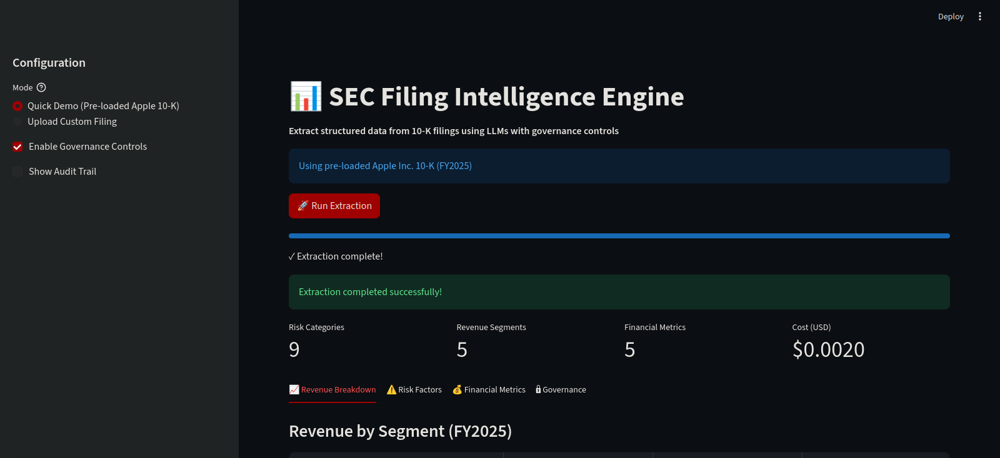
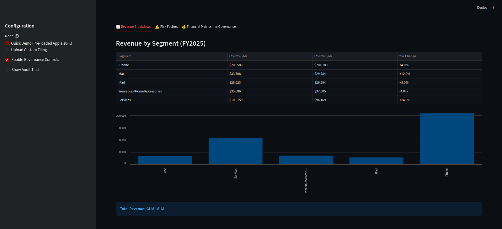
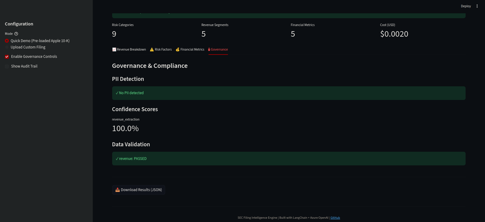

# SEC Filing Intelligence Engine

An AI-powered system for extracting structured data from SEC 10-K filings using LLMs, built with production-grade governance controls for financial services environments.

## 🎯 Project Overview

This project demonstrates:
- **GenAI/NLP**: LLM-based extraction of unstructured financial narratives
- **Production Engineering**: Audit logging, PII detection, confidence scoring
- **Financial Domain Knowledge**: Understanding of 10-K structure, capital markets data needs
- **Compliance Awareness**: Data governance controls for regulated environments

**Built for**: RBC Capital Markets AI Engineer role application

---

## 🖼️ Screenshots

### Main Interface


### Revenue Breakdown


### Governance Controls


## 🚀 Quick Start

### Prerequisites
- Python 3.9+
- Azure OpenAI access (or modify for OpenAI/Anthropic API)

### Installation
```bash
# Clone repository
git clone https://github.com/alex-abrehforoush/Independent-Mini-Projects.git
cd SEC Filing Intelligence Engine/sec-filing-intelligence

# Create virtual environment
python3 -m venv venv
source venv/bin/activate  # On Windows: venv\Scripts\activate

# Install dependencies
pip install -r requirements.txt

# Configure Azure OpenAI
cp .env.example .env
# Edit .env with your credentials
```

### Run Demo
```bash
# Launch Streamlit interface
streamlit run app.py

# Or run CLI extraction
python main.py

# Or run with governance controls
python governance_demo.py

# Or run evaluation
python evaluate.py
```

---

## 📊 Features

### Core Functionality
- ✅ **Multi-section extraction**: Risks, revenue breakdown, financial metrics
- ✅ **Structured outputs**: Pydantic schemas ensure type safety
- ✅ **Accurate data extraction**: 100% accuracy on revenue data (validated against ground truth)
- ✅ **Cost-effective**: ~$0.002 per 10-K extraction

### Governance & Compliance
- 🔒 **Audit logging**: Complete data lineage with SHA256 hashing
- 🔍 **PII detection**: Automated scanning for personal information
- 📈 **Confidence scoring**: Quantitative quality metrics (0-1 scale)
- ✅ **Data validation**: Reasonableness checks on extracted financials
- 📝 **Compliance documentation**: See `docs/compliance_considerations.md`

### Production-Ready Design
- 🎯 **Error handling**: Robust extraction with fallback patterns
- 💰 **Cost tracking**: Token usage and API cost monitoring
- 📊 **Evaluation framework**: Automated accuracy testing
- 🔄 **Reproducibility**: Deterministic outputs (temperature=0)

---

## 🏗️ Architecture
```
┌─────────────────┐
│   10-K HTML     │
│   (SEC EDGAR)   │
└────────┬────────┘
         │
         ▼
┌─────────────────┐
│ Document Parser │  ← Extracts sections (Risk Factors, Financials)
│  (BeautifulSoup)│
└────────┬────────┘
         │
         ▼
┌─────────────────┐
│  LLM Extractor  │  ← Azure OpenAI GPT-4o-mini
│  (LangChain)    │  ← Structured outputs (Pydantic)
└────────┬────────┘
         │
         ├─────────────────┐
         │                 │
         ▼                 ▼
┌─────────────────┐  ┌──────────────┐
│ Audit Logger    │  │  Validators  │
│ (Data Lineage)  │  │ (PII, Conf.) │
└─────────────────┘  └──────────────┘
         │
         ▼
┌─────────────────┐
│ Structured JSON │
│    Output       │
└─────────────────┘
```

---

## 📁 Project Structure
```
sec-filing-intelligence/
├── app.py                          # Streamlit UI
├── main.py                         # CLI extraction
├── governance_demo.py              # Governance demonstration
├── evaluate.py                     # Accuracy evaluation
├── requirements.txt
├── .env                            # API credentials (gitignored)
├── data/
│   └── apple_10k_2024.htm         # Sample 10-K filing
├── src/
│   ├── document_parser.py         # HTML → text extraction
│   ├── extractor.py               # LLM-based extraction
│   ├── schemas.py                 # Pydantic data models
│   ├── evaluator.py               # Accuracy metrics
│   ├── audit_logger.py            # Compliance logging
│   └── validators.py              # PII detection, confidence scoring
├── ground_truth/
│   └── apple_2025_revenue.json    # Manual verification data
├── output/
│   ├── complete_extraction.json
│   ├── governed_extraction.json
│   └── evaluation_report.json
├── logs/
│   └── audit_*.jsonl              # Audit trails
└── docs/
    └── compliance_considerations.md
```

---

## 🎯 Results

### Extraction Accuracy (Apple 10-K FY2025)
- **Revenue segments**: 100% accuracy (5/5 correct)
- **Risk coverage**: 80% (4/5 key risks identified)
- **Cost per document**: $0.0021

### Sample Output
```json
{
  "revenue": {
    "segments": [
      {"segment_name": "iPhone", "revenue_current": 209586.0, "percentage_change": 4.0},
      {"segment_name": "Mac", "revenue_current": 33708.0, "percentage_change": 12.0},
      {"segment_name": "Services", "revenue_current": 109158.0, "percentage_change": 14.0}
    ],
    "total_revenue": 416161.0
  }
}
```

---

## 🔮 Future Enhancements

1. **RAG for Q&A**: Enable natural language queries over multiple filings
2. **Multi-document analysis**: Compare companies within same sector
3. **Real-time monitoring**: Track 10-K/10-Q filings as they're published
4. **XBRL integration**: Use structured data to validate LLM extractions
5. **Fine-tuned models**: Domain-specific model for financial narratives

---

## 📚 Technical Decisions

### Why LangChain?
- Structured output parsing with Pydantic
- Easy integration with multiple LLM providers
- Built-in prompt templating

### Why GPT-4o-mini?
- Cost-effective ($0.15/1M input tokens vs $10/1M for GPT-4)
- Sufficient for extraction tasks (doesn't require reasoning)
- Fast inference (~2-3 seconds per extraction)

### Why Streamlit?
- Rapid prototyping for demos
- No frontend JavaScript needed
- Easy to showcase to non-technical stakeholders

---

## 🤝 Contributing

This is a portfolio project, but feedback welcome! Open an issue or reach out.

---

## 📄 License

MIT License - See LICENSE file

---

## 👤 Author

**Your Name**
- LinkedIn: [linkedin.com/in/alex-abrehforoush](https://www.linkedin.com/in/alex-abrehforoush/)
- Email: alex.abrehforoush@gmail.com

---

## 🙏 Acknowledgments

- Apple Inc. for publicly available 10-K filings
- Anthropic/OpenAI for LLM APIs
- SEC EDGAR for financial data access